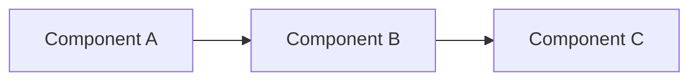

<!--
  Reusable README template for individual project repos.
  Copy this into a new repo as README.md and fill in every [bracketed] section.
  Delete this comment block once filled in.
-->

<div align="center">

# [Project Name]

[](LICENSE)

<!-- add/remove badges to match the actual stack: Terraform, Ansible, Helm, AWS, etc. -->

</div>

## What this is

[One paragraph. What it does, what it's for, and who it's for — e.g. "A
from-scratch guide to X" or "A production-like lab for Y that runs entirely on
your laptop." State facts only — no invented metrics or outcomes.]

## Architecture


<!-- Replace with the real architecture. Keep it accurate — this is a diagram
     of what the repo actually builds, not an aspirational design. -->

## Quickstart

```bash
git clone https://github.com/devopsprathamesh/[repo-name].git
cd [repo-name]
# exact commands to get from clone to running — e.g. `make up`, `terraform apply`
```

**Prerequisites:** [tools + versions actually required, e.g. Vagrant 2.4+, VirtualBox 7+]

## Failures I hit and how I fixed them

> Only include failures you actually hit and root-caused. This section is what
> makes the repo credible — don't pad it.

### [Failure symptom / error message]
- **Root cause:** [what actually caused it]
- **Fix:** [what you changed, with the actual command/config diff if short]

### [Next failure]
- **Root cause:**
- **Fix:**

## Repo structure

```
.
├── [dir]/          # [what it holds]
├── [dir]/          # [what it holds]
└── [file]          # [what it does]
```

---

<div align="center">

Part of [Prathamesh More](https://github.com/devopsprathamesh)'s Kubernetes/DevOps
portfolio · Need help with Kubernetes security, EKS cost, or CI/CD? →
**[squarekubelab@gmail.com](mailto:squarekubelab@gmail.com)** ·
[squarekube.com](https://squarekube.com)

</div>
